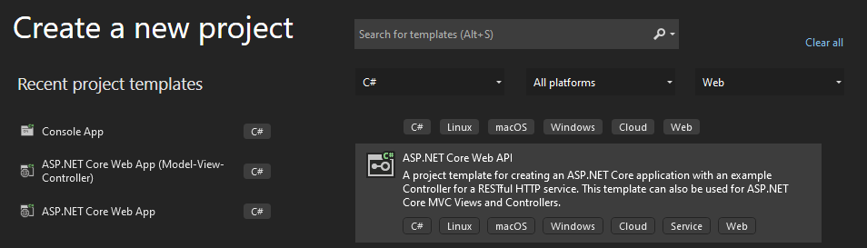
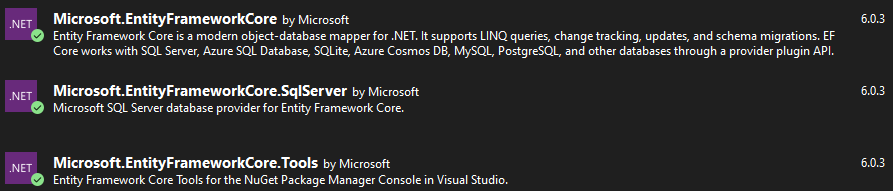
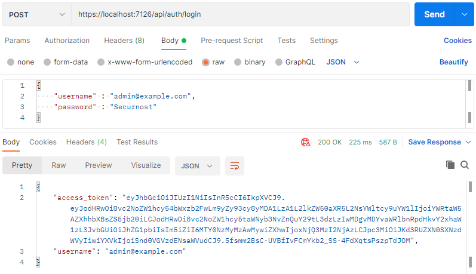
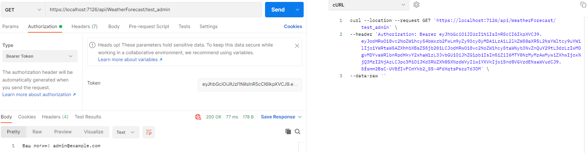

## Материалы
### ASP.NET
#### Видео

[](https://www.youtube.com/watch?v=Lxjrnc7VhsI)
В этом видео рассмотрим стандартный проект WEB API.

[](https://www.youtube.com/watch?v=p6iQMPav-n4)
В этом видео рассмотрим стандартный проект WEB API, в котором создадим простой контроллер и несколько моделей. Разберёмся, как создавать свои endpoints и обрабатывать различные типы запросов, а также как преобразовывать объекты в JSON. 

[](https://www.youtube.com/watch?v=KPEH5Y-2sLs)  
В этом видео рассмотрим стандартный проект WEB API, в котором создадим несколько простых сервисов и разберёмся, зачем они нужны и при чём тут Dependency Injection. 

[](https://www.youtube.com/watch?v=DKxhadoDi8g)  
В этом видео рассмотрим подключение к БД и использование механизма ORM, в частности подхода Code First, при котором на основании описанных моделей данных генерируется БД. 
## Краткая вводная в ASP.NET 

[Официальная документация Microsoft по ASP.NET](https://docs.microsoft.com/en-us/aspnet/core/?view=aspnetcore-6.0)

[Базовый мануал по ASP.NET Core 6](https://metanit.com/sharp/aspnet6/) - данный мануал рекомендуется ИСКЛЮЧИТЕЛЬНО для понимания разницы между .NET 6 и более старыми версиями, примеры кода, которые тут показаны имеют место быть, но в профессиональной разработке неуместны. Мы будем рассматривать разработку на основе паттерна MVC.

[Огромный русскоязычный мануал по ASP.NET Core 5 (немного больше информации  более глубоий разбор механик)](https://metanit.com/sharp/aspnet5/) - именно данный манул рекомендован к изучению, единственное отличие показанных примеров от .NET 6 заключается в конфигурации приложения, о чем будет написано ниже.

### Создание приложения WebApi

Для работы с .NET 6 **ОБЯЗАТЕЛЬНО** использование Visual Studio 2022, более старые версии не поддерживают .NET 6.



На рисунке представлено окно создания проекта, для первого модуля необходимо как раз использовать тип проекта Web API, так как нам не нужны еще представления и HTML страницы.

После создания проекта, в нем будет несколько папок и файлов, рассмотрим самые ключевые:

### Класс Program.cs

В более ранних версиях ASP.NET (.NET Core 2, 3, 3.1, .NET 5) конфигурация и точка входа в приложение была разделена на 2 отдельных класса:
* `Program.cs` - точка входа в приложение, в нем осуществлялся билд и запуск всего приложения;
* `Startup.cs` - конфигурация и настройка приложения, подключение зависимостей в контейнер зависимостей, настройка авторизации и аутентификации, подключение контекста БД и т.д.

В `.NET 6` файл `Startup` был убран, теперь все конфигурации и запуск приложения происходят в `Program.cs`.

Рассмотрим некоторые моменты более детально:

```c# 
var builder = WebApplication.CreateBuilder(args);
```
`builder` - объект, при помощи которого и происходит создание и настройка приложения. [Более детально о конфиге приложения](https://metanit.com/sharp/aspnet6/2.1.php)


### Контроллеры

Центральным звеном в архитектуре `ASP.NET Core MVC` является `контроллер`. При получении запроса система маршрутизации выбирает для обработки запроса нужный контроллер и передает ему данные запроса. Контроллер обрабатывает эти данные и посылает обратно результат обработки. [Подробнее](https://metanit.com/sharp/aspnet5/5.1.php).

Обратите внимание, что в отличии от `PHP`, в `ASP.NET` присутствует встроенная система маршрутизации, которая позволяет сильно упростить разработку приложения.
О маршрутизации можно детально почитать [Вот тут](https://metanit.com/sharp/aspnet5/11.5.php), [вот тут](https://metanit.com/sharp/aspnet6/3.1.php) и [тут](https://docs.microsoft.com/ru-ru/aspnet/core/fundamentals/routing?view=aspnetcore-6.0#custom-route-constraints)

После создания пустного приложения, следуя инструкциям ниже в проекте будет один контроллер `WeatherForecastController`

```c#
[ApiController] // Атрибут, который говорит фреймворку о том, что это API контроллер.
[Route("api/[controller]")] // Базовая настройка маршрутизации, которая говорит о том, что все эндпоинты, которые будут в этом контроллере будут начинаться с <domain>/api/WeatherForecast/
public class WeatherForecastController : ControllerBase
{
    private static readonly string[] Summaries = new[]
    {
        "Freezing", "Bracing", "Chilly", "Cool", "Mild", "Warm", "Balmy", "Hot", "Sweltering", "Scorching"
    };

    private readonly ILogger<WeatherForecastController> _logger;

    public WeatherForecastController(ILogger<WeatherForecastController> logger) // конструктор класса. Через конструкторы классов в .NET можно подключать зависимости через контейнер зависимостей (Dependency Injection)
    {
        _logger = logger;
    }

    [HttpGet(Name = "GetWeatherForecast")] // Атрибут, который указывает на то, что этот метод будет принимать запросы GET без параметров.
    public IEnumerable<WeatherForecast> Get()
    {
        return Enumerable.Range(1, 5).Select(index => new WeatherForecast
        {
            Date = DateTime.Now.AddDays(index),
            TemperatureC = Random.Shared.Next(-20, 55),
            Summary = Summaries[Random.Shared.Next(Summaries.Length)]
        }).ToArray();
    }
}
```

Полезные ссылки чтобы детальнее понять что написано к комментариях к коду выше:

[Dependency Injection и подключение сервисов в приложение](https://metanit.com/sharp/aspnet5/6.1.php)

[Атрибуты маршрутизации](https://metanit.com/sharp/aspnet5/11.6.php)

### Создание собственного сервиса и подключение его к контроллеру

За основу возьмем стандартный код, который генерируется при создании приложения. Перенесем логику, которая генерирует ответ в `Get` методе контроллера `WeatherForecast` в отдельный сервис, зарегистриуем его и подключим к контроллеру через DI (Dependency Injection).

Шаг 1. Создание интерфейса и декларация методов.

Добавим в проект папку `Services` и в ней создадим интерфейс `IWeatherService.cs` и далее его реализуем:

```c#
public interface IWeatherService
{
    WeatherForecast[] GenerateWeather();
}

public class WeatherForecastService : IWeatherService
{
    private static readonly string[] Summaries = new[]
    {
        "Freezing", "Bracing", "Chilly", "Cool", "Mild", "Warm", "Balmy", "Hot", "Sweltering", "Scorching"
    };

    public WeatherForecast[] GenerateWeather()
    {
        return Enumerable.Range(1, 5).Select(index => new WeatherForecast
        {
            Date = DateTime.Now.AddDays(index),
            TemperatureC = Random.Shared.Next(-20, 55),
            Summary = Summaries[Random.Shared.Next(Summaries.Length)]
        }).ToArray();
    }
}
```

Шаг 2. Регистрация зависимостей в контейнере 

Идем в Program.cs и регистрируем зависимость:

```c#
builder.Services.AddScoped<IWeatherService, WeatherService>();
```

Данный код добавляет зависимость в контейнер зависимостей с типом жизненного цикла `Scoped`

Всего есть 3 ключевых типа жизненных циклов:

* `Transient`: при каждом обращении к сервису создается новый объект сервиса. В течение одного запроса может быть несколько обращений к сервису, соответственно при каждом обращении будет создаваться новый объект. Подобная модель жизненного цикла наиболее подходит для легковесных сервисов, которые не хранят данных о состоянии

* `Scoped`: для каждого запроса создается свой объект сервиса. То есть если в течение одного запроса есть несколько обращений к одному сервису, то при всех этих обращениях будет использоваться один и тот же объект сервиса.

* `Singleton`: объект сервиса создается при первом обращении к нему, все последующие запросы используют один и тот же ранее созданный объект сервиса

В зависимости от типа сервиса выбирайте нужный жизненный цикл.

Теперь подключим сервис в контроллер через конструктор контроллера:

```c#
[ApiController]
[Route("api/[controller]")]
public class WeatherForecastController : ControllerBase
{
    private readonly ILogger<WeatherForecastController> _logger;
    private readonly IWeatherService _weatherService;
    public WeatherForecastController(ILogger<WeatherForecastController> logger,
            IWeatherService weatherService)
    {
        _logger = logger;
        _weatherService = weatherService; //Пробрасываем сервис в конструкторе из контейнера зависимостей
    }

    [HttpGet]
    public IEnumerable<WeatherForecast> Get()
    {
        return _weatherService.GenerateWeather();
    }
}
```

Обратите внимание, что теперь в контроллере отсутствует какая-либо бизнес логика, она вынесена в сервис, а все что делает контроллер - принимает запрос от пользователя, обращается к сервису и отдает результат. Также, благодаря механизму DI контроллеры ничего не знают о конкретных реализациях сервисов, контроллер знает только о существовании интерфейса и сигнатур методов в интерфейсе, можно запросто добавить новую реализацию интерфейса, изменить зависимость в `Program.cs` и приложение продолжит работу уже с новой реализацией.

### Entity Framework Core, создание и подключение БД

В данном разделе много расписывать информации не будем, детальный разбор присутствутет на сайте [Metanit](https://metanit.com/sharp/aspnet6/12.1.php) и в наших предыдущих [мануалах](../../Archive/Backend5/Backend5.md).

Перенесем данные о погоде в БД, добавим работу с БД в сервис:

Шаг 1. Подключение необходимых библиотек и создание контекста БД

Подключенные библиотеки:



Добавляем в файл `appsettings.json` строку подключения к БД
```json
"ConnectionStrings": 
{
    "DefaultConnection": "Server=(localdb)\\mssqllocaldb;Database=weatherDB;Trusted_Connection=True;"
}
```

`Server=(localdb)\\mssqllocaldb` - инстанс БД MsSQL установленной на вашем ПК, если у вас установлен SQL EXPRESS, используйте подключение к нему. По умолчанию, при установке Visual Studio у вас и так уже должен быть установлен `mssqllocaldb`.

**ВАЖНО!** При разработке API всегда нужно помнить: для работы с БД используем одни модели (классы), для работы с пользовательскими ответами и входными данными - другие. **Крайне не рекомендуется** использовать один и тот же класс для работы с БД и для генерации ответа пользователю!

В проекте создаем папку `Data`, в которой будет контекст и папка `Models`, для хранения сущностей БД.

Итак, создадим класс, который в последствии станет сущностью в БД:

```c#
public class WeatherForecast
{
    public int Id { get; set; }
    public DateTime Date { get; set; }
    public int TemperatureC { get; set; }
    public string? Summary { get; set; }
}
```

Теперь создаем контекст БД

```c#
public class ApplicationDbContext : DbContext
{
    public DbSet<WeatherForecast> WeatherForecasts { get; set; }

    public ApplicationDbContext(DbContextOptions<ApplicationDbContext> options)
        : base(options)
    {
    }

    protected override void OnModelCreating(ModelBuilder modelBuilder)
    {
        modelBuilder.Entity<WeatherForecast>().HasKey(x => x.Id);
    }
}
```

Далее регистрируем контекст в `Program.cs`

```c#
var connection = builder.Configuration.GetConnectionString("DefaultConnection"); //В файле конфигураций (application.json) в секции ConnectionStrings ищем строку подключения DefaultConnection
builder.Services.AddDbContext<ApplicationDbContext>(options => options.UseSqlServer(connection));
```

В первой строке мы из файла `appsettings.json` получаем строку подключения, которая и будет использоваться для подключения к БД.

Также, поскольку в процессе разработки могут быть добавлены новые сущности и будет необходимо выполнять миграции базы данных, нужно добавить пару инструкций, которые при запуске приложения будут автоматически применять миграции и модифицировать структуру БД.

```c#
using var serviceScope = app.Services.CreateScope();
var context = serviceScope.ServiceProvider.GetService<ApplicationDbContext>();
// auto migration
context?.Database.Migrate();
```
Показанный выше код добавляем после 

```c#
var app = builder.Build();
```

Все, теперь в проекте есть БД, можно подключать контекст через зависимости в сервис и работать.

Модифицированный код сервиса представлен ниже:

```c#
public interface IWeatherService
{
    WeatherForecastDto[] GenerateWeather();
    Task Add(WeatherForecastDto model);
}

public class WeatherService : IWeatherService
{
    private readonly ApplicationDbContext _context;

    public WeatherService(ApplicationDbContext context)
    {
        _context = context;
    }

    public WeatherForecastDto[] GenerateWeather()
    {
        return _context.WeatherForecasts.Select(x => new WeatherForecastDto
        {
            Date = x.Date,
            Summary = x.Summary,
            TemperatureC = x.TemperatureC
        }).ToArray();
    }

    public async Task Add(WeatherForecastDto model)
    {
        await _context.WeatherForecasts.AddAsync(new WeatherForecast
        {
            Date = model.Date,
            Summary = model.Summary,
            TemperatureC = model.TemperatureC
        });
        await _context.SaveChangesAsync();
    }
}
```

Добавился метод, который добавляет новую запись в БД. Метод получения данных также был модифицирован.

Обратите внимание, что для хранения данных в БД используется класс `WeatherForecast`, для работы с пользовательскими данными и для выдачи результатов по запросу используется `WeatherForecastDto` *(DTO - Data Transfer Object)*.

Оба класса представлены ниже:
```c#
public class WeatherForecastDto
{
    public DateTime Date { get; set; }
    public int TemperatureC { get; set; }
    public int TemperatureF => 32 + (int)(TemperatureC / 0.5556); //Переопределяем метод Get для данного свойства, которое будет высчитываться в зависимости от значения TemperatureC
    public string? Summary { get; set; }
}
public class WeatherForecast
{
    public int Id { get; set; }
    public DateTime Date { get; set; }
    public int TemperatureC { get; set; }
    public string? Summary { get; set; }
}
```

Как вы видите, отличия минимальны, модель хранения имеет уникальный идентификатор (который также может быть и в DTO модели для дальнейших манипуляций с данными). Модель DTO в свою очередь имеет вычисляемое поле, которое нет необходимости хранить в БД.

Также в контроллер добавляем Endpoint для POST запроса на добавление данных.

```c#
[HttpPost]
public async Task<IActionResult> Post(WeatherForecastDto model)
{
    if (!ModelState.IsValid) //Проверка полученной модели данных
    {
        return StatusCode(401, "Model is incorrect");
    }

    try
    {
        await _weatherService.Add(model);
        return Ok();
    }
    catch (Exception ex)
    {
        // TODO: Добавить логирование
        return StatusCode(500, "Errors during adding new weather forecast");
    }
}
```

В данном контроллере, оба `Endpoint` будут иметь один и тот же адрес: `https://<domain>/api/WeatherForecast/`. Но система роутинга, по указанным в запросе хидерам и телу запроса автоматически направит поток управления в нужный метод (`GET` или `POST`).


### Атрибуты авторизации

Для проверки авторизации (любыми средствами: `JWT токен`, `Basic Auth`, `OAuth`) в `ASP.NET` существуют атрибуты авторизации, которые можно настроить и переопределить для работы с необходимым механизмом.

В Вашем случае будет использован `Bearer token`, который вы будете генерировать для пользователя после успешной авторизации. В примере ниже будет показано как использовать атрибуты авторизации в вашем проекте.

В качестве самого токена будем использовать `JWT (JSON Web Token)`. Почитать о JWT можно [тут](https://jwt.io/). Из статьи по ссылке можно заметить, что в токен можно заложить необходимую структуру данных, которую можно будет распарсить в приложении и извлечь необходимую полезную нагрузку.

По умолчанию, в `ASP.NET` атрибут `Authorize` может работать с `JWT токенами`, поэтому приложение под них нужно просто правильно сконфигурировать.

Начнем с конфигурации приложения под работу с JWT. Прежде всего нам необходимо завести некоторые константные значения, которые будем указывать при работе с JWT.

Довольно подробно про JWT Аутентификацию можно почитать [тут](https://metanit.com/sharp/aspnet6/13.2.php).

Создадим класс JwtConfigurations:
```c#
public class JwtConfigurations
{
    public const string Issuer = "JwtTestIssuer"; // издатель токена
    public const string Audience = "JwtTestClient"; // потребитель токена
    private const string Key = "SuperSecretKeyBazingaLolKek!*228322";   // ключ для шифрации
    public const int Lifetime = 60; // время жизни токена - 60 минут
    public static SymmetricSecurityKey GetSymmetricSecurityKey()
    {
        return new SymmetricSecurityKey(Encoding.ASCII.GetBytes(Key));
    }
}
```

Далее идем в `Program.cs` и конфигурируем приложения под работу с `JWT`. От конфигурации будет зависеть принцип работы атрибутов и реакцию приложения на авторизационные данные.

Сразу необходимо установить Nuget-пакет `Microsoft.AspNetCore.Authentication.JwtBearer`!

Добавляем в `Program.cs` следующий код:

```c#
builder.Services.AddAuthorization();
builder.Services.AddAuthentication(JwtBearerDefaults.AuthenticationScheme)
    .AddJwtBearer(options =>
    {
        options.TokenValidationParameters = new TokenValidationParameters
        {
            // указывает, будет ли валидироваться издатель при валидации токена
            ValidateIssuer = true,
            // строка, представляющая издателя
            ValidIssuer = JwtConfigurations.Issuer,
            // будет ли валидироваться потребитель токена
            ValidateAudience = true,
            // установка потребителя токена
            ValidAudience = JwtConfigurations.Audience,
            // будет ли валидироваться время существования
            ValidateLifetime = true,
            // установка ключа безопасности
            IssuerSigningKey = JwtConfigurations.GetSymmetricSecurityKey(),
            // валидация ключа безопасности
            ValidateIssuerSigningKey = true,
            
        };
    });
```
А также после 
```c#
var app = builder.Build();
```
добавляем:
```c#
app.UseAuthentication();
app.UseAuthorization();
```

Все, приложение сконфигурировано, теперь необходимо правильно прописать логику генериации и проверки JWT токентов в API контроллерах. Создаем API контроллер `AuthController`, который будет отвечать за регистрацию и логин пользователей.

```c#
[Route("api/[controller]")]
[ApiController]
public class AuthController : ControllerBase
{
    // тестовые данные вместо использования базы данных
    private readonly List<User> _users = new List<User>
    {
        new User { Login="admin@example.com", Password="Securnost", Role = "admin" }
    };

    [HttpPost("login")]
    public IActionResult Token([FromBody] LoginDto model)
    {
        var identity = GetIdentity(model.UserName, model.Password);
        if (identity == null)
        {
            return BadRequest(new { errorText = "Invalid username or password." });
        }

        var now = DateTime.UtcNow;
        // создаем JWT-токен
        var jwt = new JwtSecurityToken(
            issuer: JwtConfigurations.Issuer,
            audience: JwtConfigurations.Audience,
            notBefore: now,
            claims: identity.Claims,
            expires: now.Add(JwtConfigurations.Lifetime),
            signingCredentials: new SigningCredentials(JwtConfigurations.GetSymmetricSecurityKey(), SecurityAlgorithms.HmacSha256));
        var encodedJwt = new JwtSecurityTokenHandler().WriteToken(jwt);

        var response = new
        {
            access_token = encodedJwt,
            username = identity.Name
        };

        return new JsonResult(response);
    }

    private ClaimsIdentity GetIdentity(string username, string password)
    {
        var user = _users.FirstOrDefault(x => x.Login == username && x.Password == password);
        if (user == null)
        {
            return null;
        }

        // Claims описывают набор базовых данных для авторизованного пользователя
        var claims = new List<Claim>
        {
            new Claim(ClaimsIdentity.DefaultNameClaimType, user.Login),
            new Claim(ClaimsIdentity.DefaultRoleClaimType, user.Role)
        };

        //Claims identity и будет являться полезной нагрузкой в JWT токене, которая будет проверяться стандартным атрибутом Authorize
        var claimsIdentity =
            new ClaimsIdentity(claims, "Token", ClaimsIdentity.DefaultNameClaimType, ClaimsIdentity.DefaultRoleClaimType);
        return claimsIdentity;
    }
    }
```

В вашем случае при авторизации нужно доставать пользователя из БД.

Проверим работоспособность методов авторизации:



Как мы видим, при правильном логине и пароле в ответ отдается сгенерированный токен в поле `access_token` в результирующем `JSON`.

Теперь напишем просто Endpoint, который позволит протестировать токен:

```c#
[HttpGet]
[Authorize]//Данный Endpoint доступен только для авторизованных пользователей
[Route("test_login")]
public IActionResult TestAuth()
{
    return Ok($"Ваш логин: {User.Identity.Name}");
}

[HttpGet]
[Authorize(Roles = "admin")]
[Route("test_admin")]
public IActionResult TestAdmin()
{
    return Ok($"Ваш логин: {User.Identity.Name}");
}
```

Как можно обратить внимание, над названием метода, среди прочих атрибутов теперь присутствует атрибут `[Authorize]`, который автоматически распарсит JWT токен из хидера, определит что токен валидный, определит роли пользователя. Также, в атрибут `[Authorize]` можно прописать роли, для которых тот или иной Endpoint может быть доступен. *Рекомендация: названия ролей выносите в константы в отдельный класс, чтобы не использовать строки в атрибутах и при создании ролей и клеймов!!!*

Проверим работоспособность атрибута:

